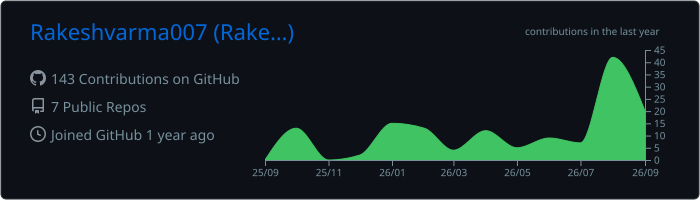
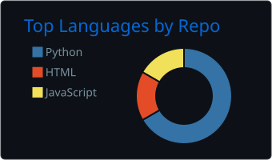
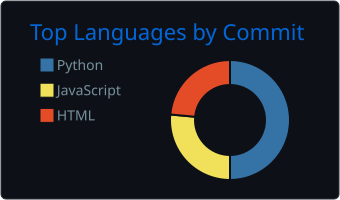
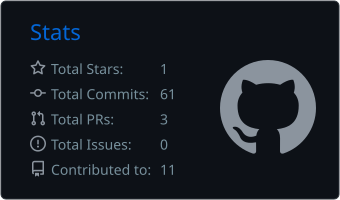
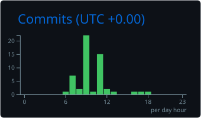
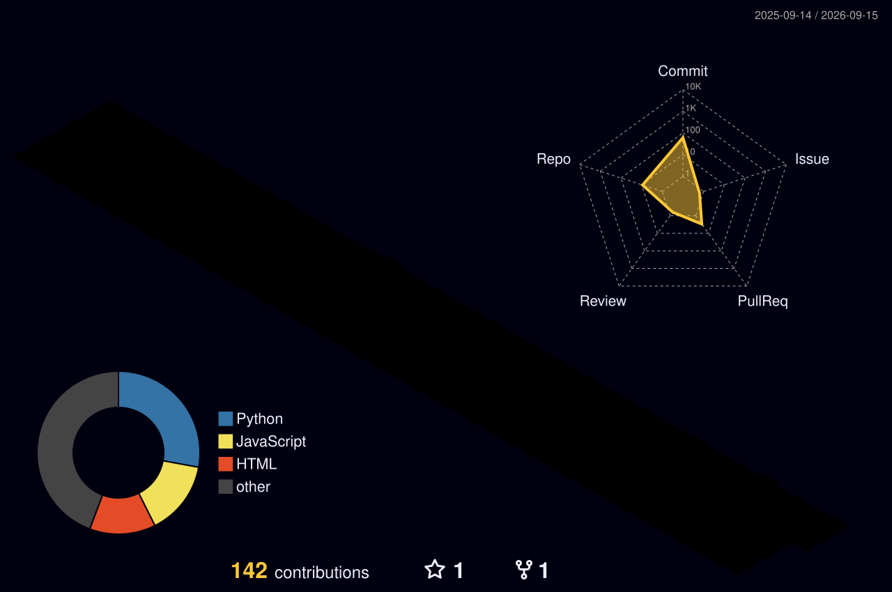

  

[Visit My Portfolio](https://rakeshvarma007.github.io/portfolio-website/)

  

  
  
  

### Languages

  
  
  
  
  
  
  

### Machine Learning

  
  
  
  

### Tools & Infrastructure

  
  
  
  
  

## Profile Analytics

  
  
  
  
  

## Contribution Activity

  

## Random DEV Quote

  

